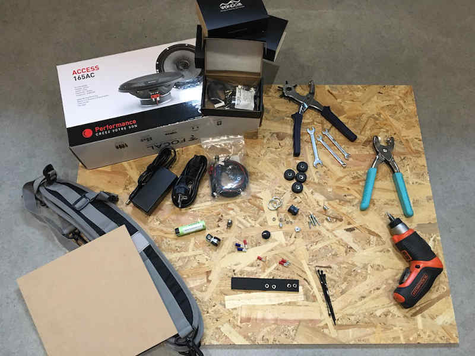
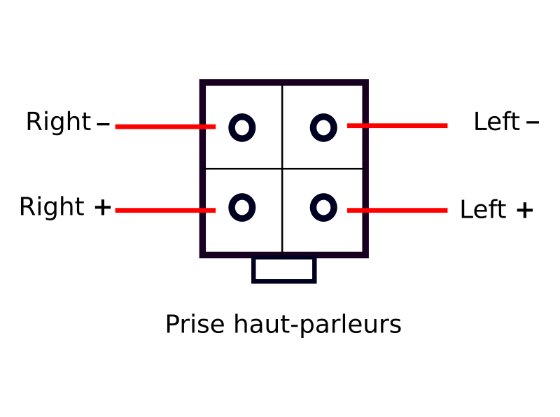
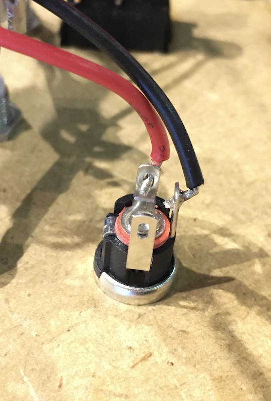
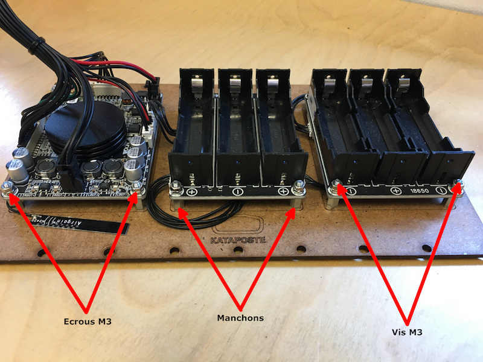
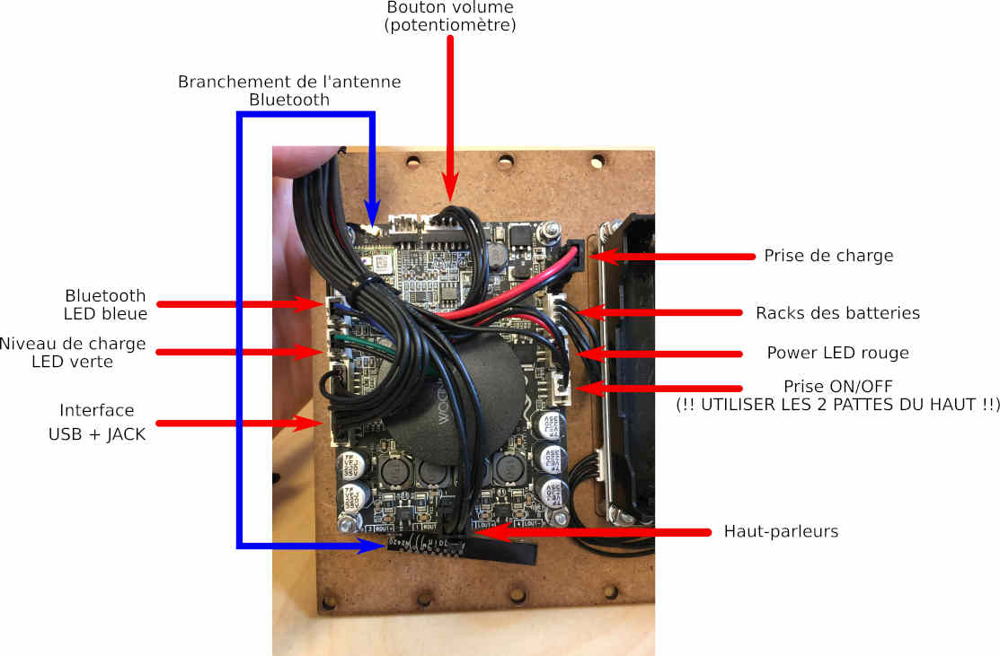
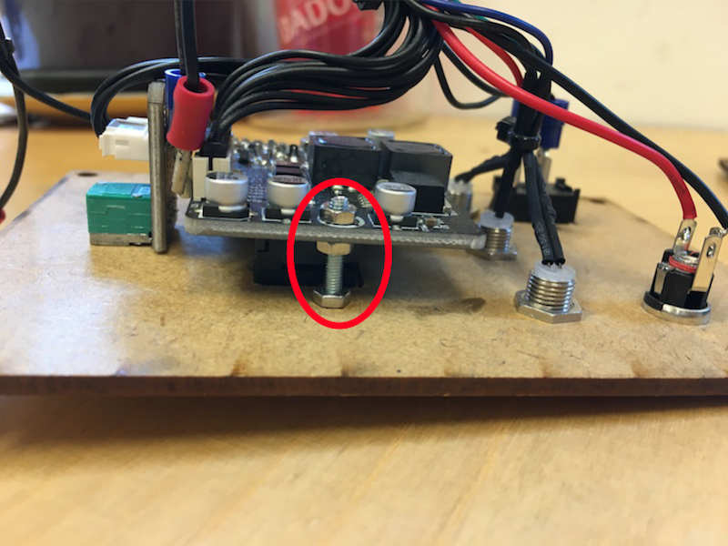
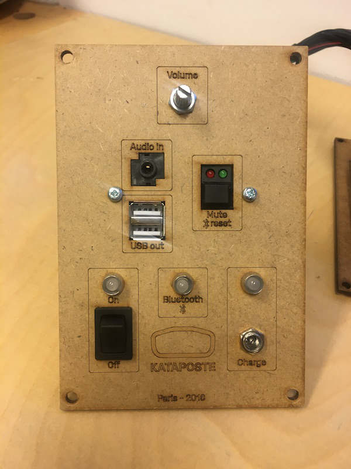
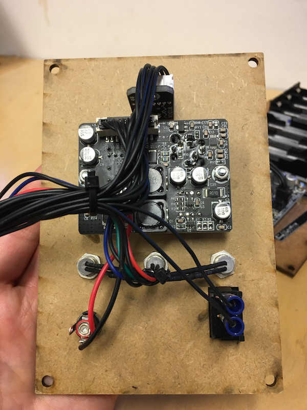
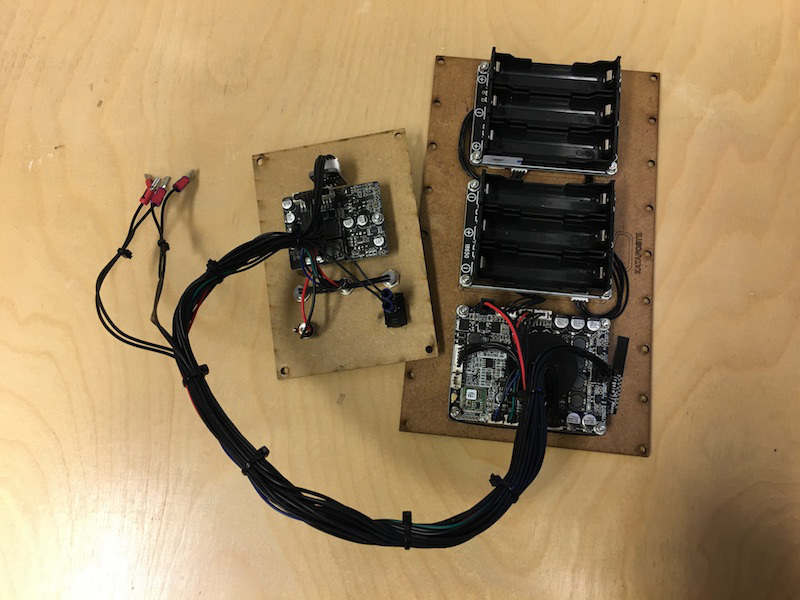

# Fais ton propre Kataposte

## <ins>1. Le matériel complet

* Planches d'OSB 3 de 9mm (800 x 600 mm) (x2)
* Planche MDF (300 x 300 mm) (x1)
* Paire de haut-parleurs 165 mm de diamètre (x1)
* [Module amplificateur sétéréo](https://www.audiophonics.fr/fr/modules-amplificateur/wondom-aa-ja32171-jab-2-50-module-amplificateur-stereo-class-d-2x50w-4-ohm-bluetooth-40-p-10847.html) (x1)
* [Racks batteries](https://www.audiophonics.fr/fr/modules-alimentation/wondom-ps-bc12111-bcpb2-module-bms-d-alimentation-chargeur-de-batterie-lithium-18650-avec-protections-p-13079.html) (x2)
* [Interface d'extension](https://www.audiophonics.fr/fr/modules-amplificateur/wondom-jab-2-aa-ja11112-interface-d-extension-jack-35mm-chargeur-usb-p-10848.html?search_query=WONDOM%20JAB%202%20AA-JA11112&fast_search=fs)(x1)
* [Lot de câbles](https://www.audiophonics.fr/fr/modules-amplificateur/wondom-jab-2-aa-ja11114-package-cables-fonctionnels-pour-module-sure-jab-2-p-10850.html)
* Pieds caoutchouc 25 x 10 mm (x4)
* Lanière de cuir larg. 24 mm (x1)
* Oeillets ouverture en étoile diam 4 mm (x2)
* Rondelles pour oeillets à rouler diam 4 mm (x2)
* Alimentation secteur DC 19V (x1)
* Batterie L-ion 18650 3200mAh (x6)
* Anneaux (x6)
* Vis M3 20 mm (x14)
* Vis M4 20 mm (x28)
* Vis M4 25 mm (x38)
* Ecrous M3 (x18)
* Ecrous M4 (x12)
* Inserts M4 (x38)
* Ecrous carrés M4 9x9x2.5 mm (x24)
* Vis à bois M4 16 mm (x12)
* Manchon Hexagonal 5.5 x 9 mm (x12)
* Interrupteur à bascule noir unipolaire à une direction (x1)
* Bouton pour potentiomètre 6 mm (x1)
* Serre-câbles (~ x10)
* Cosses à sertir Femelle 4.75 x 0.5mm Isolé Rouge (borne +) (x2)
* Cosses à sertir Femelle 2.79 x 0.5mm Isolé Rouge (borne -) (x2)
* Cosse à sertir Femelle 4.75 x 0.8mm Isolé Bleu (x2)
* Clip en P 8 mm (x10)
* [Embase femelle](https://sinolec.co.uk/fr/prise-dc-et-audio/1211317-embase-femelle-dc-souder-dc-025m-1.html) (x1)
* Kit fer à souder
* Bretelles sac à dos (lot de 2) - [Exemple](https://www.jupojiemall.com/index.php?main_page=product_info&products_id=96410)
* [Bandoulière universelle](https://www.dimatex.fr/fr/la-boutique/1379-bandouliere-full-black-1m.html) (x1)
* Tournevis cruciforme (idéalement visseuse électrique)
* Clés de 5.5, 7 et 10
* Pince perforatrice ou une alêne du bon diamètre
* Pince à oeillets

### <ins>2. Plan de découpe du caisson OSB

Voici les fichiers de découpe prêts à l'emploi que nous utilisons :
* [Face A](tmp/laser/face-a.pdf)
* [Face B](tmp/laser/face-b.pdf)
* [Façade et plaque coeur](tmp/laser/facade-et-plaque-ampli.pdf)

Mais également le lien vers notre github où vous retrouverez les fichiers sources que vous pourrez remodeler à votre guise :

[kataposte source](https://github.com/kataposte/kataposte-165/tree/master/src) : ouvrez la page > clique droit sur kataposte-165.svg > enregistrer la cible du lien sous

### <ins>3. Soudures

Avant de commencer : si vous avez un doute sur quel fil est lequel, aidez-vous de la photo qui détaille le branchement du coeur un peu plus bas.

* Souder les fils des haut-parleurs aux cosses rouges + et - en tenant compte du schéma ci-dessous __(vue du dessus avec les fils partants vers le haut)__:

* Souder les 2 cosses bleues aux fils du bouton ON/OFF.

* Souder les fils noirs et rouges de la prise alimentation comme indiqué sur la photo :

### <ins>4. Assemblage coeur et façade

#### __*Coeur :*__

Le coeur sera disposé comme ceci :

A l'aide des vis M3, des écrous M3 et des manchons, fixer les 3 composants électroniques (ampli + 2 racks batteries) à la plaque MDF.

Voici comment brancher le kit de câbles au coeur :

#### __*Façade :*__

Insérer la carte électronique de la façade dans la planche MDF. Il faudra jouer un peu avec afin de faire rentrer les ports USB en premier pour que le reste suive.

Fixer la carte avec 1 vis M3 et 3 écrous des deux côtés :

Ajuster la hauteur des écrous si besoin pour que la carte soit droite.

Insérer le reste des composants : le bouton potentiomètre, les 3 LED, la prise alimentation et le bouton ON/OFF (en faisant attention d'orienter ce dernier avec les 2 pattes vers le haut).

Utiliser les serre-câbles afin de rassembler tous les câbles proprement, en prenant soin de laisser de la longueur pour les 4 cosses des haut-parleurs :

### <ins>5. Montage du caisson

Télécharger le [plan de montage](tmp/pdf/plan-montage-kataposte-165.pdf) au format PDF

N'hésitez pas à nous contacter si vous avez la moindre question : contact@kataposte.com